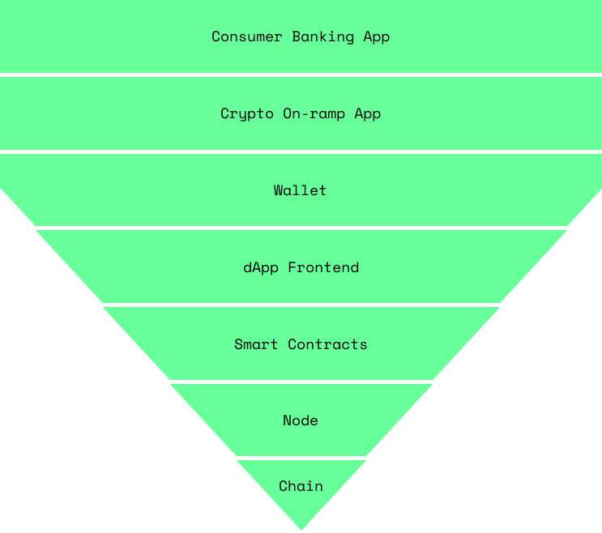

# About Cypher Technology

Cypher Security is a suite of on-chain security tools designed for on-chain protocols. In order to understand why, we have to look at a consumers journey through crypto.

## Crypto UX

When someone wants to deposit into a protocol on-chain, they must go through six steps in order to get their transaction added to a block on a distributed ledger.

At each step we see a potential exploit:

1. `Consumer Banking App` - fraudulent transactions, losing your PIN on a debit card, losing your password
2. `Crypto On-ramp App` - losing your password, seed phrase
3. `Wallet` - losing your seed phrase, your private key
4. `dApp Frontend` - connecting to a malicious frontend, unknowingly handing over permissions
5. `Smart Contracts` - sign approvals for unknown transactions, approving unknown behavior, protocol you want to use gets hacked
6. `Node` - MEV front-running your transaction

We looked at each step and saw that all of the hacks had the same thing in common, they were exploited at the transaction layer. So, we built software that exists right before this layer.

### How do you retain composability with other protocols?

One of the primary benefits of smart contracts is the fact that we can call a business’s root function without needing permission.

Cypher maintains this with extremely fast anomaly detection and whitelists. You can customize any integrations into other protocols that you want!

### How do you stop transactions without affecting new whales?

As our algorithm gains more exposure, it will learn faster. This is still a technical feature we are endeavoring to improve.

### How does this benefit my protocol?

Your team can now experiment more on main-net without worrying about hacks. Just like if you were publishing to a deveveloper environment in cloud infra.
